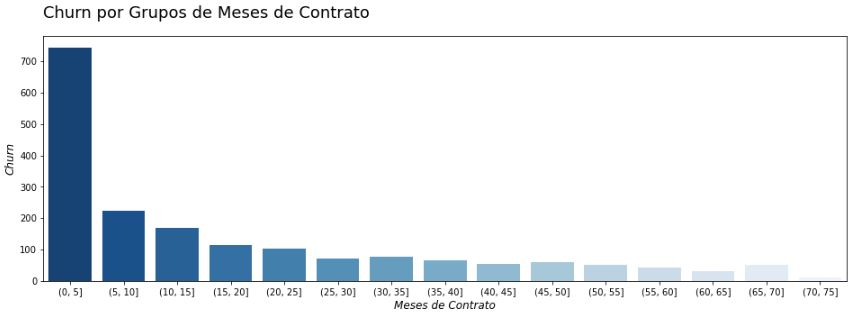
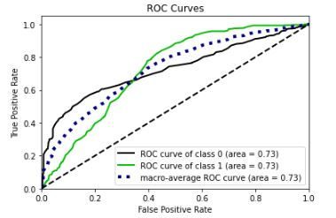

# alura_challenge_ds
Desafio de Data Science da plataforma Alura. Projeto de redução da Taxa de Evasão de Clientes, conhecido como Churn Rate.

# 1.0 - Business Problem (Fictitious Scenario)

Após alguns anos de atuação, a empresa de teletomunicações Alura Voz precisou realizar uma reunião com o time de vendas e com o time de dados. Durante a reunião, muitos pontos importantes foram levantados. Porém, dada a priorização de recursos, foi decidido que as equipes precisarão focar na redução da taxa de evasão de clientes (churn rate). Com a definição do projeto e da estratégia, a equipe de dados iniciou suas atividades para resolver este problema da empresa.

O conjunto de dados usado pode ser encontrado no <a href="https://github.com/sthemonica/alura-voz">Repositório da Alura Voz</a>.

|Atributo | Definição
------------ | -------------
|customerID | número de identificação único de cada cliente|
|Churn | se o cliente deixou ou não a empresa |
|gender | gênero (masculino e feminino) |
|SeniorCitizen | informação sobre um cliente ter ou não idade igual ou maior que 65 anos |
|Partner | se o cliente possui ou não um parceiro ou parceira|
|Dependents | se o cliente possui ou não dependentes|
|tenure | meses de contrato do cliente|
|PhoneService | assinatura de serviço telefônico|
|MultipleLines | assisnatura de mais de uma linha de telefone |
|InternetService | assinatura de um provedor internet |
|OnlineSecurity | assinatura adicional de segurança online |
|OnlineBackup | assinatura adicional de backup online |
|DeviceProtection | assinatura adicional de proteção no dispositivo |
|TechSupport | assinatura adicional de suporte técnico, menos tempo de espera |
|StreamingTV | assinatura de TV a cabo |
|StreamingMovies | assinatura de streaming de filmes |
|Contract | tipo de contrato |
|PaperlessBilling | se o cliente prefere receber online a fatura |
|PaymentMethod | forma de pagamento |
|Charges.Monthly | total de todos os serviços do cliente por mês |
|Charges.Total | total gasto pelo cliente |

# 2.0 - Business Assumptions

# 3.0 - Solution Strategy

O desenvolvimento da solução seguirá a metodologia CRISP-DM/DS:

1. **Business problem:** Desenvolver um modelo de machine learning para classificar clientes que entrarão em churn. Dessa forma, o time de negócio pode atuar com antecedência, diminuindo a taxa de evasão de clientes.

2. **Business understanding:** Entender todas as features e relacioná-las com o fenômeno a ser identificado (churn). Encontrar as métricas do negócio de forma a nortear nossas análises futuras.

3. **Data extraction:** Coletar os dados em formato json no <a href="https://github.com/sthemonica/alura-voz">Repositório da Alura Voz</a>.

4. **Data cleaning:** Utilizar python e algumas de suas bibliotecas para checar outliers, detecção/tratamento de valores faltantes e realizer engenharia de recursos.

5. **Exploratory data analysis:** Gerar insights e entender como as variáveis do nosso dataset se relacionam com a nossa variável resposta. Nesta etapa já conseguimos gerar valor para o time de negócio, ao mesmo tempo em que identificamos variáveis importantes para utilizar no modelo.

6. **Modeling:** Com as análises feitas na EDA e utilizando o algoritmo Extra Tree Classifier, conseguimos ter ainda mais clareza acerca das variáveis importantes para o modelo. Nesta etapa, além de converter as variáveis categóricas em númericas, iremos normalizar seus valores e balancear o nosso conjunto de dados, visando um melhor desempenho para os modelos.

7. **ML Algorithms:** Nesta etapa iremos construir diferentes modelos de machine learning, incluindo um modelo simples (dummy classifier) que servirá como base para os demais. Aqui também faremos uso da cross-validation para garantir valores assertivos das métricas de todos os modelos criados. Os modelos usados foram: KNN, Regressão Logística, SVM, Random Forest e AdaBoost.

8. **Evaluation:** Para avaliar os modelos criados, utilizaremos as métricas de Precisão, Recall, Acurácia e F1-Score. A decisão da métrica preferencial será escolhida durante as reuniões de cada ciclo CRISP-DM do projeto.

9. **Deployment:**

# 4.0 - Top Data Insights

- A maior taxa de churn (40%) está entre os clientes com até 5 meses de contrato.
- 83% dos clientes que entraram em churn não tinham suporte técnico.
- Dentre os clientes que entraram em churn, 75% fazem uso do pagamento digital.

# 5.0 - Machine Learning Models

Após o balanceamento dos dados, dividimos em dados de treino, validação e teste. Aqui, é importante garantir que os dados estejam normalizados.

## 5.1 - Models Performance (Cross-Validation)

|Modelo | Acurácia | Recall | Precisão | F1-Score
------------ | ------------- | ------------- | ------------- | -------------
|Random Forest | 0.887+/-0.008| 0.935+/-0.006	| 0.852+/-0.012| 0.892+/-0.008|
|SVM | 0.783+/-0.016|	0.829+/-0.008|	0.759+/-0.024|	0.793+/-0.012|
|KNN | 0.764+/-0.014|	0.863+/-0.014|	0.721+/-0.018|	0.785+/-0.01|
|AdaBoost | 0.772+/-0.018|	0.825+/-0.02|	0.746+/-0.02|	0.784+/-0.016
|Regressão Logística | 0.77+/-0.012|	0.813+/-0.01|	0.748+/-0.022|	0.779+/-0.008

Pelas métricas alcançadas, o modelo escolhido foi o Random Forest. Por limitações de hardware, não foi possível percorrer um grande grid de parâmetros no GridSearch (Hyperparameter Fine Tuning). Logo, o modelo final apresentou as mesmas métricas que o modelo acima de cross-validation.

## 5.1 - Final Performance (With Test Data)

|Modelo | Acurácia | Recall | Precisão | F1-Score
------------ | ------------- | ------------- | ------------- | -------------
|Random Forest | 0.89545|	0.953488|	0.854167|	0.901099

<spacer type="horizontal" width="100" height="100">  </spacer>

Com os valores encontrados, podemos assumir que o modelo conseguiu aprender bem com os dados de treino e teve uma boa generalização para os dados nunca vistos.

# 6.0 - Overall Business Results

# 7.0 - Conclusions

# 8.0 - Next steps

# 9.0 - Used Tools

<!-- 

 -->
