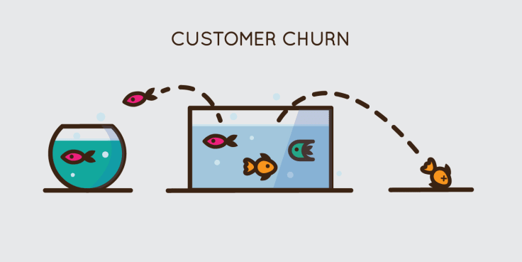

# alura_challenge_ds
Desafio de Data Science da plataforma Alura. Projeto de redução da Taxa de Evasão de Clientes, conhecido como Churn Rate.

# 1.0 - Business Problem (Fictitious Scenario)

Após alguns anos de atuação, a empresa de teletomunicações Alura Voz, precisou realizar uma reunião com o time de vendas e com o time de dados. Durante a reunião, muitos pontos importantes foram levantados. Porém, dada a priorização de recursos, foi decidido que as equipes precisarão focar na redução da taxa de evasão de clientes (churn rate). Com a definição do projeto e da estratégia, a equipe de dados iniciou suas atividades para resolver este problema da empresa.

|Atributo | Definição
------------ | -------------
|customerID | número de identificação único de cada cliente|
|Churn | se o cliente deixou ou não a empresa |
|gender | gênero (masculino e feminino) |
|SeniorCitizen | informação sobre um cliente ter ou não idade igual ou maior que 65 anos |
|Partner | se o cliente possui ou não um parceiro ou parceira|
|Dependents | se o cliente possui ou não dependentes|
|tenure | meses de contrato do cliente|
|PhoneService | assinatura de serviço telefônico|
|MultipleLines | assisnatura de mais de uma linha de telefone |
|InternetService | assinatura de um provedor internet |
|OnlineSecurity | assinatura adicional de segurança online |
|OnlineBackup | assinatura adicional de backup online |
|DeviceProtection | assinatura adicional de proteção no dispositivo |
|TechSupport | assinatura adicional de suporte técnico, menos tempo de espera |
|StreamingTV | assinatura de TV a cabo |
|StreamingMovies | assinatura de streaming de filmes |
|Contract | tipo de contrato |
|PaperlessBilling | se o cliente prefere receber online a fatura |
|PaymentMethod | forma de pagamento |
|Charges.Monthly | total de todos os serviços do cliente por mês |
|Charges.Total | total gasto pelo cliente |

# 2.0 - Business Assumptions

# 3.0 - Solution Strategy

O desenvolvimento da solução seguirá a metodologia CRISP-DM/DS:

1. **Business problem:** Desenvolver um modelo de machine learning para classificar clientes que entrarão em churn.

2. **Business understanding:** Entender todas as features e relacioná-las com o fenômeno a ser identificado (churn). Encontrar as métricas do negócio de forma a nortear nossas análises futuras.

3. **Data extraction:** Coletar os dados em formato json no <a href="https://github.com/sthemonica/alura-voz">Repositório da Alura Voz</a>.

4. **Data cleaning:** Utilizar python e algumas de suas bibliotecas para checar outliers, detecção/tratamento de valores faltantes e realizer engenharia de recursos.

5. **Exploratory data analysis:**

6. **Modeling:**

7. **ML Algorithms:**

8. **Evaluation:**

9. **Deployment:**

# 4.0 - Top Data Insights

# 5.0 - Machine Learning Models

## 5.1 - Models Performance

# 6.0 - Overall Business Results

# 7.0 - Conclusions

# 8.0 - Next steps

# 9.0 - Used Tools

<!-- 

 -->
