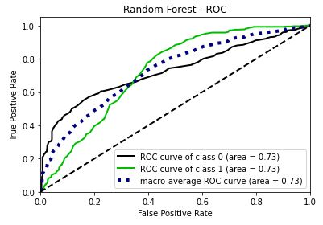

# alura_challenge_ds
Desafio de Data Science da plataforma Alura. Projeto de redução da Taxa de Evasão de Clientes, conhecido como Churn Rate.

# 1.0 - Business Problem (Fictitious Scenario)

Após alguns anos de atuação, a empresa de teletomunicações Alura Voz precisou realizar uma reunião com o time de vendas e com o time de dados. Durante a reunião, muitos pontos importantes foram levantados. Porém, dada a priorização de recursos, foi decidido que as equipes precisarão focar na redução da taxa de evasão de clientes (churn rate). Com a definição do projeto e da estratégia, a equipe de dados iniciou suas atividades para resolver este problema da empresa.

O conjunto de dados usado pode ser encontrado no <a href="https://github.com/sthemonica/alura-voz">Repositório da Alura Voz</a>.

|Atributo | Definição
------------ | -------------
|customerID | número de identificação único de cada cliente|
|Churn | se o cliente deixou ou não a empresa |
|gender | gênero (masculino e feminino) |
|SeniorCitizen | informação sobre um cliente ter ou não idade igual ou maior que 65 anos |
|Partner | se o cliente possui ou não um parceiro ou parceira|
|Dependents | se o cliente possui ou não dependentes|
|tenure | meses de contrato do cliente|
|PhoneService | assinatura de serviço telefônico|
|MultipleLines | assisnatura de mais de uma linha de telefone |
|InternetService | assinatura de um provedor internet |
|OnlineSecurity | assinatura adicional de segurança online |
|OnlineBackup | assinatura adicional de backup online |
|DeviceProtection | assinatura adicional de proteção no dispositivo |
|TechSupport | assinatura adicional de suporte técnico, menos tempo de espera |
|StreamingTV | assinatura de TV a cabo |
|StreamingMovies | assinatura de streaming de filmes |
|Contract | tipo de contrato |
|PaperlessBilling | se o cliente prefere receber online a fatura |
|PaymentMethod | forma de pagamento |
|Charges.Monthly | total de todos os serviços do cliente por mês |
|Charges.Total | total gasto pelo cliente |

# 2.0 - Business Assumptions

# 3.0 - Solution Strategy

O desenvolvimento da solução seguirá a metodologia CRISP-DM/DS:

1. **Business problem:** Desenvolver um modelo de machine learning para classificar clientes que entrarão em churn. Dessa forma, o time de negócio pode atuar com antecedência, diminuindo a taxa de evasão de clientes.

2. **Business understanding:** Entender todas as features e relacioná-las com o fenômeno a ser identificado (churn). Encontrar as métricas do negócio de forma a nortear nossas análises futuras.

3. **Data extraction:** Coletar os dados em formato json no <a href="https://github.com/sthemonica/alura-voz">Repositório da Alura Voz</a>.

4. **Data cleaning:** Utilizar python e algumas de suas bibliotecas para checar outliers, detecção/tratamento de valores faltantes e realizer engenharia de recursos.

5. **Exploratory data analysis:** Gerar insights e entender como as variáveis do nosso dataset se relacionam com a nossa variável resposta. Nesta etapa já conseguimos gerar valor para o time de negócio, ao mesmo tempo em que identificamos variáveis importantes para utilizar no modelo. Para checar detalhadamente a análise, basta acessar <a href="https://github.com/rodrigomm92/alura_challenge_ds/blob/main/notebooks/eda_feature_engineering.ipynb">este jupyter notebook</a>.

6. **Modeling:** Com as análises feitas na EDA (Exploratory Data Analysis) e utilizando o algoritmo Extra Tree Classifier, conseguimos ter ainda mais clareza acerca das variáveis importantes para o modelo. Nesta etapa, além de converter as variáveis categóricas em númericas, iremos normalizar seus valores e balancear o nosso conjunto de dados, visando um melhor desempenho para os modelos.

7. **ML Algorithms:** Nesta etapa iremos construir diferentes modelos de machine learning, incluindo um modelo simples (dummy classifier) que servirá como base para os demais. Aqui também faremos uso da cross-validation para garantir valores assertivos das métricas de todos os modelos criados. Os modelos usados foram: KNN, Regressão Logística, SVM, Random Forest e AdaBoost.

8. **Evaluation:** Para avaliar os modelos criados, utilizaremos as métricas de Precisão, Recall, Acurácia e F1-Score. A decisão da métrica preferencial será escolhida durante as reuniões de cada ciclo CRISP-DM do projeto.

9. **Deployment:**

# 4.0 - Top Data Insights

Durante a Análise exploratória de dados (AED), foi possível encontrar não só algumas relações entre as variáveis, mas também insights acionáveis que podem agregar bastante valor para o negócio. Essas descobertas são importantes pois conseguimos gerar valor para a empresa mesmo antes da construção de um modelo de machine learning. Os principais insights foram:

- A maior taxa de churn (40%) está entre os clientes com até 5 meses de contrato.
- 83% dos clientes que entraram em churn não tinham suporte técnico.
- Dentre os clientes que entraram em churn, 75% fazem uso do pagamento digital.

# 5.0 - Machine Learning Models

Após o balanceamento dos dados, dividimos em dados de treino, validação e teste. Aqui, é importante garantir que os dados estejam normalizados, pois a maior parte dos algoritmos usados podem ser prejudicados por conta de dados com amplitudes diferentes.

O desenvolvimento dos modelos passou por 3 ciclos (<a href="https://github.com/rodrigomm92/alura_challenge_ds/tree/main/notebooks">Notebooks</a>), onde aos poucos fui testando a performance dos modelos, com diferentes normalizações, balanceamentos e com diferentes escolhas de variáveis.

## 5.1 - Models Performance (Cross-Validation)

|Modelo | Acurácia | Recall | Precisão | F1-Score
------------ | ------------- | ------------- | ------------- | -------------
|Random Forest | 0.887+/-0.008| 0.935+/-0.006	| 0.852+/-0.012| 0.892+/-0.008|
|SVM | 0.783+/-0.016|	0.829+/-0.008|	0.759+/-0.024|	0.793+/-0.012|
|KNN | 0.764+/-0.014|	0.863+/-0.014|	0.721+/-0.018|	0.785+/-0.01|
|AdaBoost | 0.772+/-0.018|	0.825+/-0.02|	0.746+/-0.02|	0.784+/-0.016
|Regressão Logística | 0.77+/-0.012|	0.813+/-0.01|	0.748+/-0.022|	0.779+/-0.008

Pelas métricas alcançadas, o modelo escolhido foi o Random Forest, pois não só apresentou as melhores médias das métricas, como também menor variação (baixo desvio padrão). Por limitações de hardware, não foi possível percorrer um grande grid de parâmetros no GridSearch (Hyperparameter Fine Tuning). Logo, o modelo final apresentou praticamente o mesmo desempenho que o modelo acima de cross-validation.

## 5.2 - Final Performance (With Test Data)

Com o modelo treinado e devidamente otimizado, utilizaremos os dados de teste para validar a sua performance e capacidade de generalização. Este resultado é bastante importante para decidirmos se iremos continuar com o modelo (apresentando boas métricas) ou descontinuá-lo e desenvolver novos modelos nos próximos ciclos CRISP-DM.

|Modelo | Acurácia | Recall | Precisão | F1-Score
------------ | ------------- | ------------- | ------------- | -------------
|Random Forest | 0.89545|	0.953488|	0.854167|	0.901099

<spacer type="horizontal" width="100" height="100">  </spacer>

Com os valores encontrados, podemos garantir que o modelo conseguiu aprender bem com os dados de treino e teve uma boa generalização para os dados nunca vistos. Além disso, devido ao alto valor de Recall, nosso modelo conseguiu prever corretamente 95% de todos os clientes que realmente entraram em churn. Isso tem um valor muito importante para o negócio, pois há praticamente a garantia de que encontramos todos os clientes que irão entrar em churn.

# 6.0 - Overall Business Results

Após obter os resultados técnicos do nosso modelo, é de extrema importância comunicar este desempenho falando na linguagem de negócio. Portanto, considerando que os nossos dados de teste fossem a simulação de dados de clientes futuros, utilizaremos esse conjunto para projetar nosso faturamento.

Com esses dados, aplicaremos o nosso modelo e obteremos uma lista de clientes que entrarão em churn e os que não entrarão. A partir daí, calcularemos quantos reais os clientes em churn deixarão de gastar com a nossa empresa, levando em consideração a nossa taxa de recall de 95%. Essa quantia será o nosso benefício, pois consideraremos que com o nosso modelo e a estratégia do time de negócio, conseguiremos manter tais clientes.

**Com a aplicação do modelo, no primeiro ano esperamos ter um faturamento de R$ 275,347.57**

# 7.0 - Conclusions

Após cumpridas todas as etapas de desenvolvimento do nosso projeto, conseguimos ter insights valiosos, modelo robusto apresentando excelentes métricas e um valor em reais de benefício após o projeto implementado. Com isso, conseguimos gerar muito valor ao time de negócios e à empresa como um todo. Principais aspectos do projeto:

- Como 82% dos clientes que entraram em churn têm o plano sem dependentes, uma ação para diminuir essa taxa pode ser incentivar clientes a assinarem planos com dependentes, ou planos com ideia semelhante, como planos familiares,amigos, etc.

- De forma bem parecida, temos que 83% dos clientes que entratam em churn não tem suporte técnico. Logo, uma ação para diminuir essa taxa pode ser incentivar o cliente a adquirir o suporte técnico.

- Notamos que dos clientes que entraram em churn, 75% estavam optando pelo pagamento digital. Isso é inesperado pois esperávamos justamente o comportamento oposto. Logo, esta descoberta servirá para guiar os demais times no intuito de entender os problemas técnicos deste meio de pagamento

- Nosso modelo apresentou altos valores de Recall, Acurácia e Precisão. Mostrando ser um modelo bastante confiável para ser colocado em produção

- Com a implementação deste modelo, esperamos que em um ano obtenhamos um faturamento de R$ 275,347.57.

# 8.0 - Next steps

- Realizar o deploy do modelo em cloud, para que seja acessível a demais usuários.

# 9.0 - Used Tools

<!-- 

 -->
